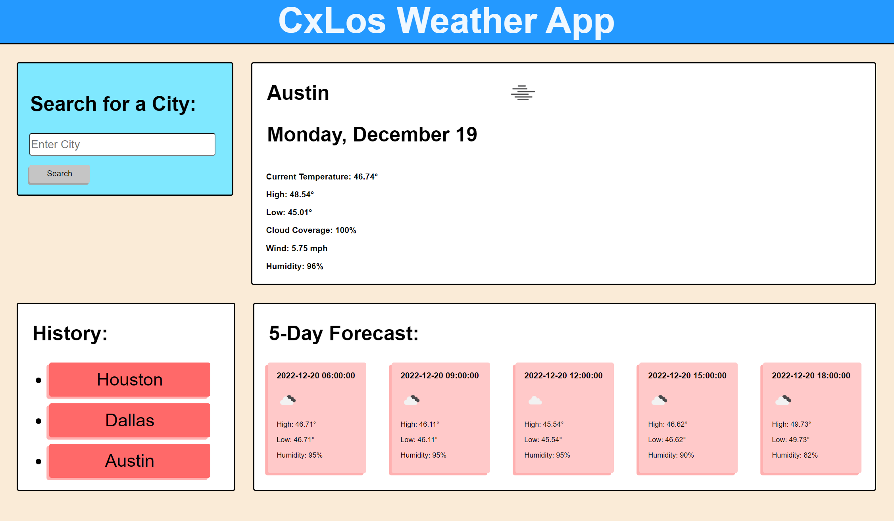

# Cxlos6-Weather-App

## Description

The purpose of this project is to serve as a quick, handy weather app that gives you details on the current weather, as well as a snapshot of a 5-day forecast for any city that you search. With this project, I learned how to use APIs, and it was very challenging for me at first, but after repetitive use, tutoring, and reading the dcoumentation, I finally got a hold of it.

## Table of Contents

- [Usage](#usage)
- [License](#license)

## Usage

To use the weather app, just enter the name of the city that wish you to retrieve the weather forecast from, click submit, and you will be presented with weather data for that location.

[Cxlos6 Weather App](https://cxlos.github.io/Cxlos6-Weather-App/)

## License

MIT License

Copyright (c) 2022 CxLos

Permission is hereby granted, free of charge, to any person obtaining a copy
of this software and associated documentation files (the "Software"), to deal
in the Software without restriction, including without limitation the rights
to use, copy, modify, merge, publish, distribute, sublicense, and/or sell
copies of the Software, and to permit persons to whom the Software is
furnished to do so, subject to the following conditions:

The above copyright notice and this permission notice shall be included in all
copies or substantial portions of the Software.

THE SOFTWARE IS PROVIDED "AS IS", WITHOUT WARRANTY OF ANY KIND, EXPRESS OR
IMPLIED, INCLUDING BUT NOT LIMITED TO THE WARRANTIES OF MERCHANTABILITY,
FITNESS FOR A PARTICULAR PURPOSE AND NONINFRINGEMENT. IN NO EVENT SHALL THE
AUTHORS OR COPYRIGHT HOLDERS BE LIABLE FOR ANY CLAIM, DAMAGES OR OTHER
LIABILITY, WHETHER IN AN ACTION OF CONTRACT, TORT OR OTHERWISE, ARISING FROM,
OUT OF OR IN CONNECTION WITH THE SOFTWARE OR THE USE OR OTHER DEALINGS IN THE
SOFTWARE.
